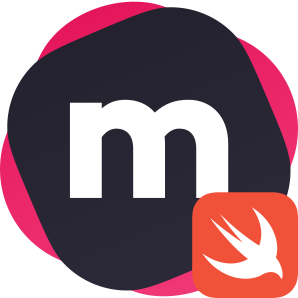

<p align="center">
  
</p>

<h1 align="center">MeiliSearch-Swift</h1>

<h4 align="center">
  <a href="https://github.com/meilisearch/MeiliSearch">MeiliSearch</a> | 
  <a href="https://www.meilisearch.com">Website</a> | 
  <a href="https://blog.meilisearch.com">Blog</a> | 
  <a href="https://fr.linkedin.com/company/meilisearch">LinkedIn</a> | 
  <a href="https://twitter.com/meilisearch">Twitter</a> | 
  <a href="https://docs.meilisearch.com">Documentation</a> | 
  <a href="https://docs.meilisearch.com/resources/faq.html">FAQ</a>
</h4>

<p align="center">
  <a href="https://github.com/ppamorim/meilisearch-swift/actions"></a>
  <a href="https://github.com/ppamorim/meilisearch-swift/blob/master/LICENSE"></a>
  <a href="https://slack.meilisearch.com"></a>
</p>

<p align="center">⚡ Lightning Fast, Ultra Relevant, and Typo-Tolerant Search Engine MeiliSearch client written in Swift 🍎</p>

**MeiliSearch-Swift** is a client for **MeiliSearch** written in Swift. **MeiliSearch** is a powerful, fast, open-source, easy to use and deploy search engine. Both searching and indexing are highly customizable. Features such as typo-tolerance, filters, and synonyms are provided out-of-the-box.
For more information about features go to [our Swift documentation](https://docs.meilisearch.com/swift).

## Features
* Search as-you-type experience (answers < 50 milliseconds)
* Full-text search
* Typo tolerant (understands typos and miss-spelling)
* Supports Kanji
* Supports Synonym
* Easy to install, deploy, and maintain
* Whole documents are returned
* Highly customizable
* RESTful API

## Get started

### Swift Package Manager

The [Swift Package Manager](https://swift.org/package-manager/) is a tool for automating the distribution of Swift code and is integrated into the `swift` compiler.

Once you have your Swift package set up, adding **MeiliSearch-Swift** as a dependency is as easy as adding it to the `dependencies` value of your `Package.swift`.

```swift
dependencies: [
    .package(url: "https://github.com/ppamorim/meilisearch-swift.git")
]
```

## Basic setup

To do a simply search using the client, you can create a Swift script like this:

```swift
import MeiliSearch

func searchForMovies() {

    // Create a new client instance of MeiliSearch with the default host.
    let client = try! MeiliSearch(Config(hostURL: "http://localhost:7700"))

    // Create a new search request with "botman" as query.
    let searchParameters = SearchParameters.query("botman")

    // Call the function search and wait for the closure result.
    self.client.search(uid: "movies", searchParameters) { result in
        switch result {
        case .success(let searchResult):
            print(searchResult)
        case .failure(let error):
            print(error)
        }
    }

}
```

## Demo

### Vapor

Please check the Vapor Demo source code [here](https://github.com/ppamorim/meilisearch-swift/tree/master/VaporDemo).

## Contributing

Hey! We're glad you're thinking about contributing to **MeiliSearch-Swift**! If you think something is missing or could be improved, please open issues and pull requests. If you'd like to help this project grow, we'd love to have you! To start contributing, checking [issues tagged as "good-first-issue"](https://github.com/meilisearch/MeiliSearch-Swift/issues?q=is%3Aissue+is%3Aopen+label%3A%22good+first+issue%22) is a good start!

### Analytic Events

Once a day, events are being sent to our Amplitude instance so we can know how many people are using MeiliSearch.<br/>
Only information about the platform on which the server runs is stored. No other information is being sent.<br/>
If this doesn't suit you, you can disable these analytics by using the `MEILI_NO_ANALYTICS` env variable.

## Contact

Feel free to contact us about any questions you may have:
* At [bonjour@meilisearch.com](mailto:bonjour@meilisearch.com): English or French is welcome! 🇬🇧 🇫🇷
* Via the chat box available on every page of [our documentation](https://docs.meilisearch.com/) and on [our landing page](https://www.meilisearch.com/).
* Join our [Slack community](https://slack.meilisearch.com/).
* By opening an issue.

Any suggestion or feedback is highly appreciated. Thank you for your support!

Swift programming language from Apple
